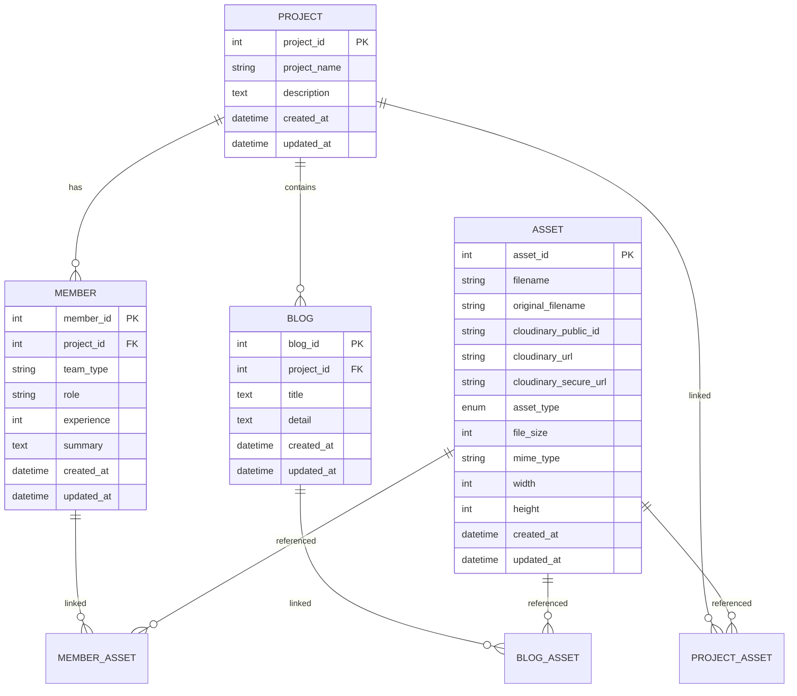

# PiXerse Backend API Documentation

## Overview

PiXerse Backend là một RESTful API được xây dựng với FastAPI, cung cấp hệ thống quản lý nội dung (CMS) cho trang landing page PiXerse.

## Architecture

### Technology Stack
- **FastAPI**: Modern Python web framework
- **SQLAlchemy**: ORM cho Python
- **PostgreSQL**: Database chính
- **Cloudinary**: Cloud storage cho media files
- **Alembic**: Database migration tool
- **Pydantic**: Data validation và serialization

### Database Schema



## API Endpoints

### Base URL
- Development: `http://localhost:8000`
- Production: `https://your-domain.com`

### Authentication
Currently, the API doesn't require authentication for read operations. Write operations are open but should be secured in production with JWT tokens.

### Projects API

#### Get All Projects
```http
GET /api/v1/projects/
```

**Query Parameters:**
- `skip` (int): Number of records to skip (default: 0)
- `limit` (int): Number of records to return (default: 100, max: 1000)

**Response:**
```json
[
  {
    "project_id": 1,
    "project_name": "Project Name",
    "description": "Project description",
    "created_at": "2024-01-01T00:00:00Z",
    "updated_at": "2024-01-01T00:00:00Z"
  }
]
```

#### Create Project
```http
POST /api/v1/projects/
Content-Type: application/json

{
  "project_name": "New Project",
  "description": "Project description"
}
```

#### Get Project by ID
```http
GET /api/v1/projects/{project_id}
```

**Response includes related data:**
```json
{
  "project_id": 1,
  "project_name": "Project Name",
  "description": "Project description",
  "created_at": "2024-01-01T00:00:00Z",
  "updated_at": "2024-01-01T00:00:00Z",
  "members": [...],
  "blogs": [...],
  "assets": [...]
}
```

#### Update Project
```http
PATCH /api/v1/projects/{project_id}
Content-Type: application/json

{
  "project_name": "Updated Name"
}
```

#### Delete Project
```http
DELETE /api/v1/projects/{project_id}
```

#### Attach Assets to Project
```http
POST /api/v1/projects/{project_id}/assets/attach
Content-Type: application/json

{
  "asset_ids": [1, 2, 3]
}
```

#### Detach Assets from Project
```http
POST /api/v1/projects/{project_id}/assets/detach
Content-Type: application/json

{
  "asset_ids": [1, 2]
}
```

### Members API

Similar CRUD operations as Projects API, with additional filtering:

```http
GET /api/v1/members/?project_id=1
```

### Blogs API

Similar CRUD operations as Projects API, with project filtering:

```http
GET /api/v1/blogs/?project_id=1
```

### Assets API

#### Upload File
```http
POST /api/v1/assets/upload
Content-Type: multipart/form-data

file: [binary file data]
```

**Response:**
```json
{
  "message": "File uploaded successfully",
  "asset": {
    "asset_id": 1,
    "filename": "image_123",
    "original_filename": "my-image.jpg",
    "cloudinary_public_id": "pixerse/images/image_123",
    "cloudinary_url": "https://res.cloudinary.com/...",
    "cloudinary_secure_url": "https://res.cloudinary.com/...",
    "asset_type": "image",
    "file_size": 1024576,
    "mime_type": "image/jpeg",
    "width": 1920,
    "height": 1080,
    "created_at": "2024-01-01T00:00:00Z"
  }
}
```

#### Get Assets with Filters
```http
GET /api/v1/assets/?asset_type=image&search=logo
```

**Query Parameters:**
- `skip`, `limit`: Pagination
- `asset_type`: Filter by type (image, video, document, other)
- `search`: Search by filename

## Error Handling

### HTTP Status Codes
- `200`: Success
- `201`: Created
- `400`: Bad Request (validation error)
- `404`: Not Found
- `422`: Unprocessable Entity (Pydantic validation)
- `500`: Internal Server Error

### Error Response Format
```json
{
  "detail": "Error message description"
}
```

### Validation Errors
```json
{
  "detail": [
    {
      "loc": ["body", "project_name"],
      "msg": "ensure this value has at least 1 characters",
      "type": "value_error.any_str.min_length"
    }
  ]
}
```

## Rate Limiting

Currently not implemented but recommended for production:
- General endpoints: 100 requests/minute
- Upload endpoints: 10 requests/minute

## File Upload Constraints

- **Max file size**: 10MB
- **Supported formats**: 
  - Images: JPEG, PNG, GIF, WebP
  - Videos: MP4, WebM, AVI
  - Documents: PDF, DOC, DOCX, TXT

## Development

### Running Locally
```bash
# Install dependencies
pip install -r requirements.txt

# Run migrations
alembic upgrade head

# Start server
python main.py
```

### Running Tests
```bash
pytest tests/ -v
```

### API Documentation
- Swagger UI: `http://localhost:8000/docs`
- ReDoc: `http://localhost:8000/redoc`
- OpenAPI JSON: `http://localhost:8000/openapi.json`

## Deployment

### Docker
```bash
# Build image
docker build -t pixerse-backend .

# Run container
docker run -p 8000:8000 --env-file .env pixerse-backend
```

### Docker Compose
```bash
# Development
docker-compose up -d

# Production
docker-compose -f docker-compose.prod.yml up -d
```

### Hugging Face Spaces
1. Create new Space with Docker SDK
2. Upload project files
3. Configure environment variables
4. Deploy automatically

## Security Considerations

### Production Checklist
- [ ] Set `DEBUG=False`
- [ ] Configure HTTPS
- [ ] Set up CORS properly
- [ ] Implement rate limiting
- [ ] Add authentication middleware
- [ ] Validate file uploads
- [ ] Set up monitoring and logging

### Environment Variables
```bash
# Required
DATABASE_URL=postgresql://...
CLOUDINARY_CLOUD_NAME=...
CLOUDINARY_API_KEY=...
CLOUDINARY_API_SECRET=...

# Optional
DEBUG=False
CORS_ORIGINS=["https://your-frontend.com"]
```

## Monitoring and Logging

### Health Check
```http
GET /health
```

**Response:**
```json
{
  "status": "healthy",
  "message": "PiXerse Backend is running"
}
```

### Logs
Application logs are sent to stdout in JSON format for easy parsing by log aggregation services.

## Support

For issues and questions:
- Check API documentation at `/docs`
- Review error messages and status codes
- Ensure all required environment variables are set
- Verify database connectivity and Cloudinary configuration
